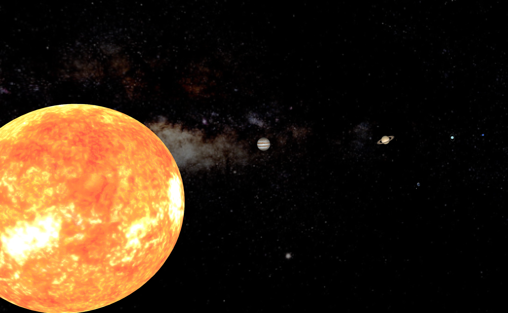

# Vulkan Solar System

An interactive Solar System application made with C++20 and Vulkan.

This application is a 3D scene of the [Solar System](https://en.wikipedia.org/wiki/Solar_System) - including the Sun, eight planets, five IAU recognised dwarf planets, Sedna, and several rings and moons of the planets. Each planet has basic Phong shader. I tried to implement bloom on the Sun, but couldn't quite get it to work properly.

This is currently my largest Vulkan project. There are definitely ways in which I could have improved the abstraction and use of Vulkan in this application - one of the main being separating pipelines and descriptor sets instead of abstracting them into a single class.

## Controls

* Standard FPS camera controls:  
  * **Mouse** to look around.  
  * **WASD** to move forwards/backwards/sideways.  
  * **Space** and **Left control** to move up and down.  
  * Hold **Left shift** for faster movement.  
  * Hold **Left alt** for slower movement.  
  * Hold **C** to zoom in.  
* Time speed controls:  
  * **Left click** for fastest.  
  * **Middle click** for middle speed.  
  * **Right click** for slow speed.  
  * **Right shift** for very slow speed.  
  * **Enter** to pause.  
* Other controls:  
  * **F11** to toggle fullscreen.
  * **Tab** to return to the Sun.    
  * **Escape** to quit.

## Dependencies

* [SDL2](https://www.libsdl.org/download-2.0.php)  
* [Vulkan SDK](https://www.lunarg.com/vulkan-sdk/) (including [ShaderC](https://github.com/google/shaderc))
* [GLM](https://glm.g-truc.net/0.9.9/index.html)  
* [SPIR-V Cross](https://github.com/KhronosGroup/SPIRV-Cross)  
* [Vulkan Memory Allocator](https://github.com/GPUOpen-LibrariesAndSDKs/VulkanMemoryAllocator)  
* [STB Image](https://github.com/nothings/stb)  
* [Nlohmann JSON](https://github.com/nlohmann/json)  
* [TinyOBJLoader](https://github.com/tinyobjloader/tinyobjloader)  

## Asset Credits

* [Planet model](https://www.turbosquid.com/3d-models/3d-realistic-earth-photorealistic-2k-1279125)  
* Textures:  
  * [Planetary texture maps](http://celestia.simulatorlabbs.com/CelSL/textures/lores/)
  * [More planetary texture maps](https://www.solarsystemscope.com/textures/)  
  * [Pluto texture map](https://www.deviantart.com/bob3studios/art/Pluto-Texture-Map-Fixed-Blur-762286905)  
  * [Sedna texture map](https://www.deviantart.com/neptuneprogaming/art/Sedna-Texture-Map-718713842)  
  * [Saturn rings](https://www.deviantart.com/alpha-element/art/Stock-Image-Saturn-Rings-393767006)  
  * [Uranus rings](https://www.hiclipart.com/free-transparent-background-png-clipart-pofir)  
* [Milky Way cubemap](https://www.eso.org/public/images/eso0932a/)  
* [Window icon](https://freedesignfile.com/373185-solar-system-icon-vector/)  

## Building

The Visual Studio solution files are available in the repository, and can be used to build the project (I currently do not know how to set up CMake/Makefiles yet; this may change in the future).  

Worth noting is the location of the Vulkan SDK. You may need to tweak the project file so that it can properly include and link to the Vulkan SDK (including ShaderC) on your system. ShaderC might also need to be recompiled with Multi-Threaded code generation (instead of Multi-Threaded DLL).
